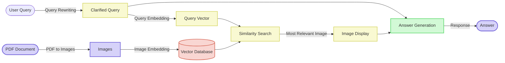

# Advanced RAG Vision Cohere

A Retrieval-Augmented Generation (RAG) system that processes PDF documents and their images to answer queries using visual content.

## Features

- 📄 **PDF Processing** - Converts PDF documents to images for visual content analysis
- 🖼️ **Image Embedding** - Converts images into vector representations for similarity search
- 🔍 **Visual Semantic Search** - Finds the most relevant image for a given query
- 🤖 **LLM Integration** - Generates answers based on the query and relevant visual content
- 📊 **Vector Database** - Stores and retrieves image embeddings efficiently
- 🔄 **Query Rewriting** - Clarifies and improves user queries for better retrieval
- 📺 **Image Display** - Shows the most relevant image for each query
- 💾 **Persistent Embeddings** - Saves embeddings to avoid reprocessing documents

## System Architecture

The following diagram illustrates the Vision RAG architecture implemented in this project:



This diagram shows how:
1. PDF documents are converted to images for processing
2. Images are embedded into vector representations
3. User queries are rewritten for clarity and embedded for similarity search
4. The system retrieves the most relevant image for the query
5. The relevant image is displayed to the user
6. The LLM generates an answer based on the query and the relevant image

## Setup

1. Install poppler binaries

- See: [pdf2image](https://pypi.org/project/pdf2image/)

2. Create an input directory:

```bash
mkdir -p data/input
```

3. Create `.env`

```
cp .env.example .env
```

4. Create and activate virtual environment:

```bash
uv venv
source .venv/bin/activate.fish
```

5. Install dependencies:

```bash
uv sync
```

6. Run the application:

```bash
python src/main.py <path-to-pdf>
```

The system will:
1. Convert the PDF to images
2. Generate embeddings for each image (or load existing embeddings if available)
3. Start an interactive query interface where you can ask questions about the visual content

To exit the interactive query interface, simply press Enter on an empty line or press Ctrl+C.

## RAG Processing Stages

### 1. Document Processing

- **PDF to Image Conversion**
  - Function: Converts PDF pages to image files
  - Output: PNG images stored in the output directory

### 2. Embedding Generation

- **Image Embedding**
  - Function: Generates vector representations of images
  - Features: Saves embeddings to avoid reprocessing

### 3. Query Processing

- **Query Rewriting**
  - Function: Clarifies and improves user queries
  - Purpose: Enhances retrieval accuracy by disambiguating queries

### 4. Retrieval

- **Vector Similarity Search**
  - Function: Finds the most similar image to the query
  - Method: Compares query vector with document embeddings

### 5. Answer Generation

- **LLM-Based Response Generation**
  - Function: Generates answers based on the query and relevant image
  - Features: Contextual understanding of visual content

## Configuration

The application uses the following default configuration:
- Output directory: `data/output`
- Embeddings file: `data/output/doc_embeddings.npy`

## Technical Components

The system consists of the following key modules:

- `knowledge_document`: Handles PDF-to-image conversion
- `embedding_model`: Creates vector representations of images and queries
- `vector_database`: Manages storage and retrieval of embeddings
- `query_rewriting`: Improves queries for better retrieval
- `query_retrieval`: Handles display of relevant images
- `answer_generation`: Generates answers using LLM

## Future Improvements

- Multi-modal LLM integration for better visual understanding
- Support for additional document formats beyond PDF
- Enhanced query understanding with conversation history
- User interface improvements for better visualization
- Batch processing for multiple documents

## Related

- [naive-rag-md-duckdb](../naive-rag-md-duckdb/)

## References

- [Vision-Language Models](https://arxiv.org/abs/2101.00529)
- [Multimodal RAG Systems](https://www.pinecone.io/learn/multimodal-rag/)
- [PDF Processing Libraries](https://pdf.wondershare.com/pdf-knowledge/best-python-libraries-for-pdf.html)
