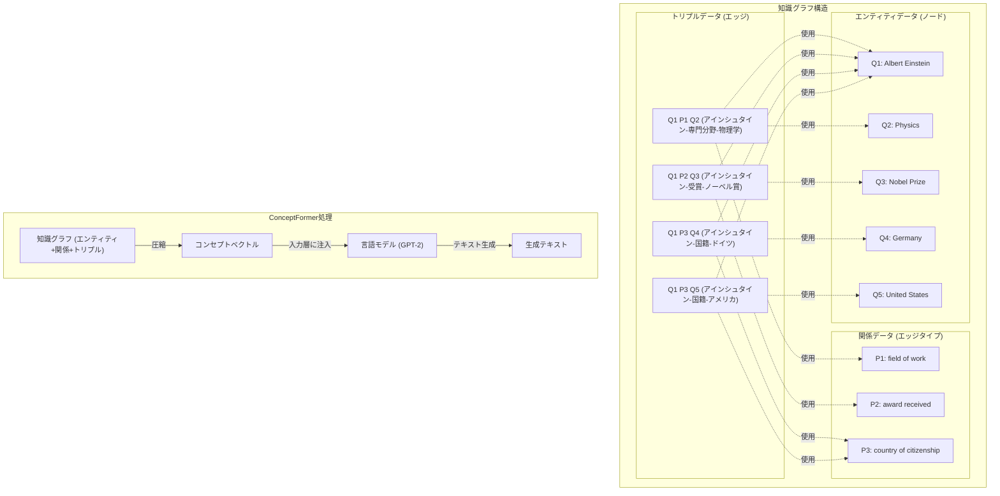

# ConceptFormer Implementation

This directory contains an implementation of the paper ["ConceptFormer: Towards Efficient Use of Knowledge-Graph Embeddings in Large Language Models"](https://www.alphaxiv.org/abs/2504.07624). Code is on [joelbarmettlerUZH/ConceptFormer](https://github.com/joelbarmettlerUZH/ConceptFormer).

## Paper Summary

* :fire: *Problems*
    * LLMs have a huge amount of knowledge, but it is difficult to extract that knowledge efficiently.
    * When leveraging knowledge graphs, current methods consume large amounts of tokens
    * Current methods often require modifications to the LLM itself and cannot easily enhance existing ones.
* :seedling: *Solutions (ConceptFormer)*
    * Compresses the information in the knowledge graph in the form of "concept vectors"
    * Inject this concept vector directly into the input layer of the language model
    * The model itself is not changed at all, only the input stage is manipulated
* :gift: *Specific Value*
    * Dramatically improves token efficiency
    * Questions about multiple people or events can also be handled.
    * look-up table of knowledge can be created in advance.
    * Greatly improves fact recall, even for small models
        * Example: Even with a **small GPT-2 model (0.1B)**, ConceptFormer improved accurate fact recall by up to **348%**.
* :warning: *Limitations*
    * Currently only tested on GPT-2 0.1B, not on larger/more recent models
    * Still underperforms specialized QA systems on complex questions
    * Limited to 1-hop neighborhood knowledge in current implementation
    * Requires pre-training on both synthetic and real-world datasets
    * Performance varies based on entity popularity and neighborhood size

## ConceptFormerの全体の流れ

このプログラムは「ConceptFormer」という、文章を生成するAIに知識を注入するシステムの例です。以下にシステムの全体の流れを順を追って説明します。

### ステップ1: おもちゃのデータセットを作る
📚 **関数**: `setup_toy_dataset()`

まず、練習用の小さなデータセットを作ります。これは「アインシュタイン」に関する簡単な情報のセットです。

例えば：
- アインシュタインは物理学者です
- アインシュタインはノーベル賞を受賞しました
- アインシュタインはドイツとアメリカの市民でした

これらの情報を「エンティティ（人や物）」と「関係」に分けて保存します。
- エンティティ: アインシュタイン、物理学、ノーベル賞、ドイツ、アメリカ
- 関係: 専門分野、受賞した賞、国籍

### ステップ2: 知識グラフをロードする
📚 **関数**: `KnowledgeGraph().load_entities()`, `load_relations()`, `load_triples()`, `load_entity_embeddings()`

作ったデータを「知識グラフ」という形でロードします。知識グラフは、エンティティ同士がどのような関係で繋がっているかを表す図のようなものです。

例えば：
- アインシュタイン →(専門分野)→ 物理学
- アインシュタイン →(受賞した賞)→ ノーベル賞

また、各エンティティには「埋め込み」という数字の列も用意します。これはコンピュータがエンティティを理解するための表現です。

### ステップ3: ConceptFormerモデルを初期化する
📚 **関数**: `ConceptFormer(model_name='gpt2', device=device)`

「GPT-2」という文章生成AIを使って「ConceptFormer」を作ります。これは計算のためにCPUかGPU(CUDA)を使います。

GPUは特殊な計算装置で、とても速く計算できます。例えると、CPUが一人の計算の天才なら、GPUは大勢の普通の計算者が同時に働くチームのようなものです。

### ステップ4: トレーニングデータを準備する
📚 **関数**: `prepare_training_data()`

AIが知識グラフの情報を理解できるようにするためのデータを準備します。

例えば、「アインシュタイン」の埋め込みと、その属性や関係性の情報を対応づけます。

### ステップ5: コンセプトエンベッダーをトレーニングする
📚 **関数**: `train_concept_embedder()`

AIに知識グラフの情報を学習させます。これは「コンセプトエンベッダー」という部分を訓練していて、知識グラフの情報を文章生成に使えるように変換する部分です。

例えるなら、知識グラフの情報を「AIの言葉」に翻訳する通訳を育てているようなものです。

### ステップ6: ルックアップテーブルを生成する
📚 **関数**: `prepare_lookup_data()`, `generate_concept_lookup()`

トレーニングしたAIを使って、エンティティごとに「コンセプトベクトル」を作ります。これはAIが簡単に参照できるように作った辞書のようなものです。

例えば、「アインシュタイン」という言葉が出てきたとき、すぐにアインシュタインに関する知識を取り出せるようにします。

### ステップ7: コンセプトベクトルを使って文章を生成する
📚 **関数**: `generate_text_with_concept()`

いよいよAIに文章を生成させます。ここでは「The famous scientist」（有名な科学者）という言葉から始めて、アインシュタインについての情報を注入しながら文章を作らせます。

通常のAIなら適当な科学者について書くかもしれませんが、このAIはアインシュタインの知識を使って、彼についての文章を生成します。

### ステップ8: 合成トリプル文を生成する
📚 **関数**: `prepare_synthetic_triples()`

最後に、知識グラフの情報を使って、アインシュタインに関する文章をいくつか生成します。

例えば：
- 「アインシュタインは物理学が専門分野です。」
- 「アインシュタインはノーベル賞を受賞しました。」

これらは知識グラフのトリプル（主語-関係-目的語）を文章に変換したものです。

### まとめ

このプログラムでは、知識グラフの情報をAIの文章生成に取り入れる方法を示しています。通常のAIは訓練データにあるパターンから文章を生成しますが、ConceptFormerは特定の知識（この例ではアインシュタインについての情報）を文章生成に直接取り込むことができます。これにより、より正確で具体的な情報を含む文章を生成できるようになります。

## 知識グラフとConceptFormerの構造

知識グラフの基本要素とConceptFormerの処理フローを以下の図で示します：



この図は知識グラフの三要素（エンティティ、関係、トリプル）の関連性と、ConceptFormerがどのようにして知識グラフの情報を圧縮して言語モデルに注入するかを示しています。

### 識別子の意味: QとP

この実装では、Wikidataの命名規則に倣った識別子を使用しています：

- **Qプレフィックス (例: Q1, Q2, Q3)**
  - 「Q」は「Query」または「Quantum」の略とも言われますが、Wikidataでは「項目」(Item)を表します
  - エンティティ（人物、場所、概念、物体など）の識別子として使用
  - 例: Q1 (Albert Einstein), Q2 (Physics), Q3 (Nobel Prize)

- **Pプレフィックス (例: P1, P2, P3)**
  - 「P」は「Property」（プロパティ/属性）の略
  - 関係や属性の識別子として使用
  - 例: P1 (field of work), P2 (award received), P3 (country of citizenship)

実際のWikidataでも、例えば「Q42」はダグラス・アダムスを、「P31」は「〜である」(instance of)という関係を表します。この命名規則を採用することで、実際の知識グラフシステムと互換性のある形式でデータを表現しています。

## シンプルな実装

この実装は論文で提案されているConceptFormerの基本的なアイデアをシンプルに実装したものです。

### 主要なコンポーネント

- `model.py`: ConceptFormerのコアモデル実装
  - `ConceptEmbedder`: 知識グラフエンベディングから「コンセプトベクトル」を生成するエンベッダー
  - `ConceptFormer`: GPT-2モデルにコンセプトベクトルを注入するメインクラス

- `kg_utils.py`: 知識グラフ処理用ユーティリティ
  - `KnowledgeGraph`: 知識グラフデータのラッパークラス
  - データ準備用関数（トレーニングデータ、ルックアップテーブル、合成文生成など）

- `example.py`: サンプル実行スクリプト
  - トイデータセットの作成
  - モデルの初期化、トレーニング、テキスト生成の例

### 実装の重要ポイント

1. **コンセプトベクトル**:
   - 知識グラフのノードエンベディングをより小さく圧縮したベクトル表現
   - GPT-2の埋め込み次元と一致するように設計

2. **コンセプトベクトルの注入**:
   - コンセプトベクトルを入力テキストのトークン埋め込みの先頭に注入
   - モデルのトランスフォーマー層や出力層は一切変更なし

3. **ルックアップテーブル**:
   - 知識グラフノードからコンセプトベクトルへの効率的なマッピングを事前計算
   - 推論時に高速にアクセス可能


### 要件

- Python 3.6+
- PyTorch 1.8+
- Transformers 4.5+
- NumPy, tqdm


### 使用方法

```python
# モデルの初期化
model = ConceptFormer(model_name='gpt2')

# コンセプトエンベッダーのトレーニング
model.train_concept_embedder(kg_embeddings, labels)

# ルックアップテーブルの生成
model.generate_concept_lookup(kg_nodes, kg_embeddings)

# コンセプトベクトルを注入してテキスト生成
generated_text = model.generate_text_with_concept(
    prompt="The famous scientist ", 
    node_id="Q1"  # Albert Einstein
)
```

### 実行例

```bash
# サンプルスクリプトを実行
cd experiments/conceptformer
python src/example.py
```

## Citation

```bibtex
@article{conceptformer2023,
  title={ConceptFormer: Towards Efficient Use of Knowledge-Graph Embeddings in Large Language Models},
  author={[Authors of the original paper]},
  journal={[Journal/Conference]},
  year={2023}
}
```
