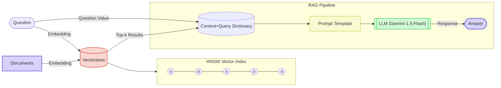

# Markdown DuckDB RAG

A simple Retrieval-Augmented Generation (RAG) system that processes markdown documents using DuckDB for vector storage and retrieval.

## Features

- 📚 **Markdown Processing** - Processes Markdown files from an input directory using UnstructuredMarkdownLoader
- 🔍 **Semantic Search** - Performs similarity search using vector embeddings to find relevant content
- 🗄️ **DuckDB with VSS Extension** - Uses DuckDB with vector similarity search extension for efficient vector storage and retrieval
- 🤖 **LLM Integration** - Generates answers using Google's Gemini models with LangChain integration
- 🧠 **Multilingual Embeddings** - Uses multilingual embedding models for cross-language understanding
- 📊 **Real-time Progress Tracking** - Shows progress with tqdm during indexing and processing
- ⚡ **Hardware Acceleration** - Utilizes MPS acceleration on Apple Silicon when available
- 🔄 **Interactive Query Interface** - Command-line REPL for querying the knowledge base
- 🧩 **Smart Document Chunking** - Splits documents into overlapping chunks for better context preservation
- 📝 **Source Attribution** - Includes document IDs with retrieved context for transparent source tracking

## System Architecture

The following diagram illustrates the RAG (Retrieval-Augmented Generation) architecture implemented in this project:



This diagram shows how:
1. Documents are processed and embedded into the vector store
2. User questions are also embedded to find relevant matches
3. The HNSW (Hierarchical Navigable Small World) index enables efficient similarity search
4. Retrieved context is combined with the question in a prompt template
5. Source IDs are included with each retrieved document for attribution
6. The LLM (Gemini-1.5-Flash) generates a response based on the prompt with source context
7. The parser extracts the final answer from the LLM response

## Setup

### Prepare markdown

1. Create an input directory:

```bash
mkdir -p input
```

2. Add your markdown files to this directory. You can:

   - Manually copy existing markdown files
   - Generate markdown from websites using tools [`experiments/crawl-with-crawl4ai`](../crawl-with-crawl4ai)
   - Create new markdown documents with your content

3. Ensure your markdown files follow standard markdown syntax for optimal processing.

### Using Local Python Environment

1. Create and activate virtual environment:

```bash
uv venv
source .venv/bin/activate.fish
```

2. Install dependencies:

```bash
uv sync
```

3. Run the application:

```bash
# The first run will build the vector database from markdown files in input/
uv run src/main.py
```

### Using Docker

Build and run the service with Docker Compose:

```bash
docker compose up --build
```

## Tech Stacks

RAG Processing Stages

### 1. Indexing

#### 1.1. Load Documents

- 📚 **LangChain - UnstructuredMarkdownLoader**
  - Function: Loads and parses Markdown files from input directory
  - Features: Processes Markdown documents while preserving structure

#### 1.2. Split Documents

- 🧩 **LangChain - RecursiveCharacterTextSplitter**
  - Function: Splits documents into chunks with configurable size and overlap
  - Features: Maintains context through overlapping chunks (default: 1000 chars with 200 char overlap)
  - Altanatives: [spaCy](https://spacy.io/), [advanced-chunker](https://github.com/rango-ramesh/advanced-chunker)

#### 1.3. Embedding

- 🧠 **HuggingFace Embeddings**
  - Model: [`intfloat/multilingual-e5-large-instruct`](https://huggingface.co/intfloat/multilingual-e5-large-instruct)
  - Function: Generates 1024-dimensional embeddings with multilingual support
  - Features: Normalized embeddings for better similarity search
- 🚀 **PyTorch with MPS Acceleration**
  - Function: Automatically detects and uses Apple Silicon MPS acceleration when available
  - Features: Falls back to CPU when MPS is not available

#### 1.4. Store Documents

- 📊 **DuckDB with VSS Extension**
  - Function: Lightweight, embedded analytical database for vector storage and search
  - Features:
    - `hnsw` indexing: Fast approximate nearest neighbor search
    - Persistent index for faster subsequent queries
    - Batched insertion for better performance
    - SQL-based vector similarity search
  - Alternatives: [Chroma](https://github.com/chroma-core/chroma), [Weaviate](https://github.com/weaviate/weaviate), [Faiss](https://github.com/facebookresearch/faiss)

| Feature | **DuckDB + VSS Extension** | **Weaviate** | **Faiss** |
| --- | --- | --- | --- |
| **Overall** | Lightweight all-in-one SQL + vector option for local analytics or batch RAG | Fully-featured vector DB with hybrid search & production features | Fast, flexible library for custom similarity-search pipelines |
| **Primary role** | Embedded SQL database with vector search | Stand-alone vector database service | Vector search library |
| **Vector storage** | Yes — embeddings stored in `ARRAY` / `LIST` columns inside ordinary tables | Yes — objects and their vectors are stored together | Yes (vectors only) — no metadata storage |
| **Document / metadata storage** | Yes — any SQL table can hold full documents & metadata | Yes — object schema includes properties + vector | No — keep docs/metadata in an external store |
| **Vector indexing** | HNSW via `CREATE INDEX … USING vss_hnsw` | Built-in Flat, HNSW, dynamic index | Many: HNSW, IVF-PQ, Flat, OPQ, etc. |
| **Similarity search** | k-NN with cosine, L2, etc. via SQL (`ORDER BY distance`) | Vector k-NN and hybrid BM25 + vector | Core API for k-NN with multiple distance metrics |
| **Filtering** | Standard SQL `WHERE`, joins, window functions | Rich boolean & range filters on metadata | Limited — usually filter results externally |
| **Scalability** | Scales with host resources; embeddable in any process | Cloud-native, horizontal sharding, multi-tenancy | Scales as a library you embed; cluster logic is up to you |
| **Configuration / deployment** | Zero-config: single shared-library or Python package | Runs as a service (Docker/K8s, managed cloud) | Linked/installed as a library in application code |
| **Persistence** | Yes — single DuckDB file or MotherDuck cloud | Yes — durable storage back-ends (Badger, RocksDB, etc.) | Manual — call `faiss.write_index` / `read_index` |

### 2. Retrieval

#### 2.1. Semantic Search

- 🔍 **Vector Similarity Search with DuckDB**
  - Function: Finds semantically similar documents using cosine similarity
  - Features:
    - `list_cosine_similarity`: Efficient vector comparison
    - Configurable top-k retrieval (default: top 3 results)
    - Results ranked by similarity score
    - Document IDs included for source attribution

### 3. Generation

#### 3.1 Generate contextual answers

- 🤖 **LangChain with Google Generative AI**
  - Model: `gemini-1.5-flash` (configurable)
  - Function: Generates contextual answers based on retrieved documents
  - Features:
    - Template-based prompting with context integration
    - Source attribution with document IDs for traceability
    - Multilingual output support (configurable output language)
    - Error handling for LLM generation

#### System Integration & User Interface

- 🔄 **Application Architecture**
  - Function: Combines document processing, vector storage, and LLM generation in a cohesive pipeline
- 📈 **Progress Visualization**
  - Function: Uses tqdm for visualizing progress during document processing and embedding
- 🎨 **Rich Console Output**
  - Function: Enhances terminal output with colors and formatting for better readability
- 🔐 **Environment Configuration**
  - Function: Uses dotenv for secure API key management

## Configuration

The application uses the following default configuration:
<br/>
See [`src/main.py` -> `class Config`](./src/main.py)

## FAQ

- **How is the vector dimension determined?**

  - The vector dimension (1024) is defined by the specific embedding model used. For `intfloat/multilingual-e5-large-instruct`, the dimension is 1024.

- **What happens when I change the embedding model?**

  - When changing models, you'll need to update the `embedding_vector_dim` in the configuration to match the new model's output dimension.
  - The database table will need to be recreated to accommodate the new vector dimensions.

- **How can I optimize performance?**
  - For large document collections, consider increasing batch sizes for database insertion
  - Enable hardware acceleration (GPU/MPS) by ensuring PyTorch is properly installed
  - Adjust chunk size and overlap based on your specific content and query patterns

- **Does the system support source attribution?**
  - Yes, retrieved context includes document IDs that are passed to the LLM
  - Source IDs are included in the prompt to enable citation in responses
  - This helps track which documents contributed to the answer

## References

Overview:

- [labdmitriy/llm-rag](https://github.com/labdmitriy/llm-rag)
- [Retrieval-Augmented Generation (RAG)](https://comfyai.app/article/llm-applications/retrieval-augmented-generation)

Tech Stacks

- [DuckDB Documentation](https://duckdb.org/docs/)
- [DuckDB VSS Extension](https://github.com/duckdb/duckdb_vss)
- [HuggingFace E5 Models](https://huggingface.co/intfloat/multilingual-e5-large-instruct)
- [LangChain Documentation](https://python.langchain.com/docs/get_started/introduction)
- [tqdm Progress Bar](https://github.com/tqdm/tqdm)

private chat history for future...:

- [RAG改善最新研究](https://chatgpt.com/c/680ba05a-8418-8009-86c4-8f6926e2e460)
- [DuckDBの日本語検索機能の説明](https://gemini.google.com/app/4b4da0802afa1a55)
